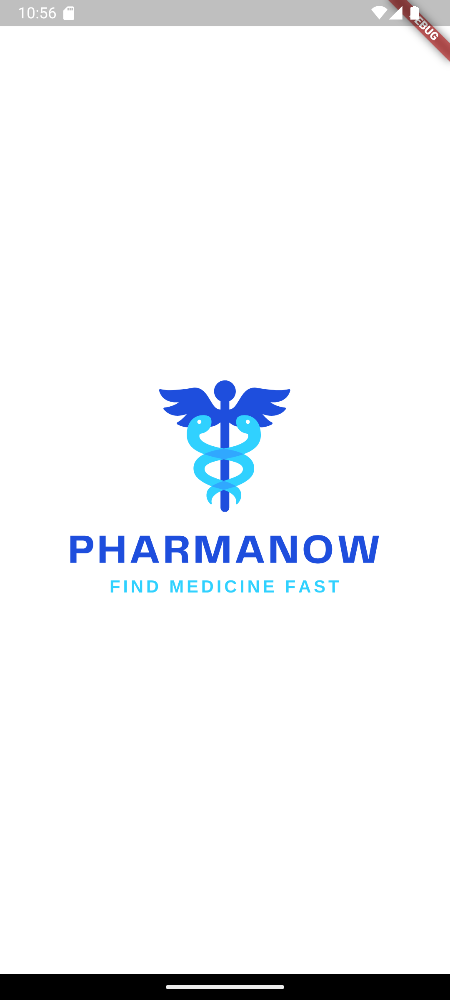
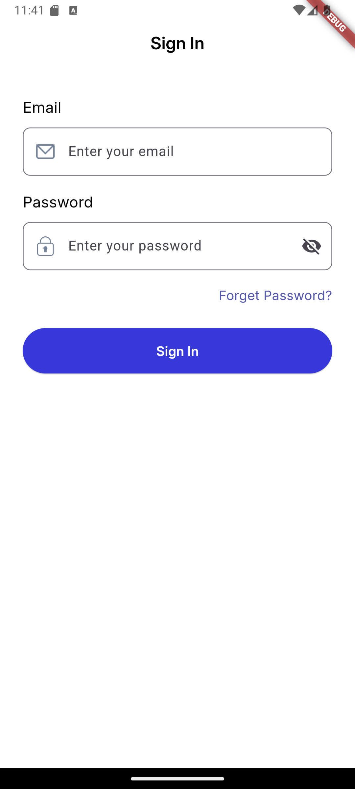
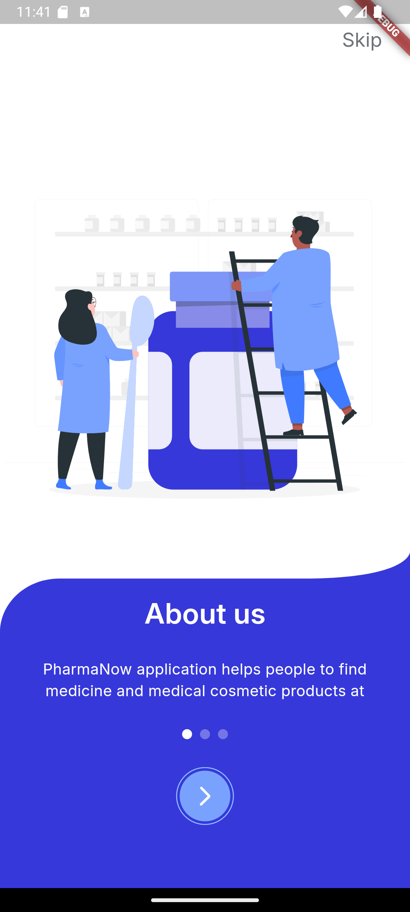
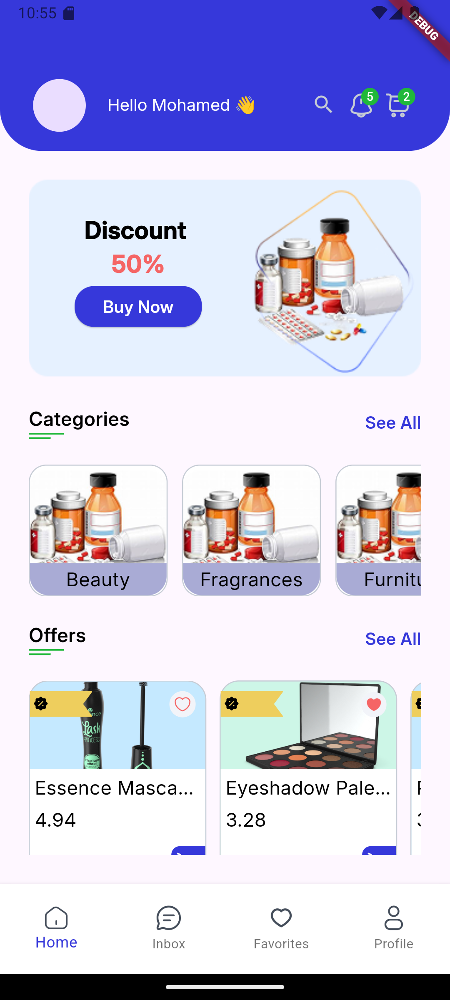

# project_minia
### =============
### This project is the last iti minia professional training.
### tools used in this project:
### - flutter
### - free dummy api
### - shared preferences
### - hive
### - get it
### - Dio
### - flutter_bloc (cubit as state management)
### - freezed
### - json serializable
### =========================
# project structure:
### - data: contains all data sources and repositories
### - domain: contains all entities 
### - presentation: contains all ui and cubits
### - core: contains all shared classes and constants
### - main.dart: the entry point of the app
### =========================
# project features:
### - splash screen
### - login screen
### - home screen
### - onboarding screen
### ======================
# Screen shots
### ============
### <table>
###   <tr>
###     <td></td>
###     <td></td>
###     <td></td>
###     <td></td>
###   </tr>
###   </table>

